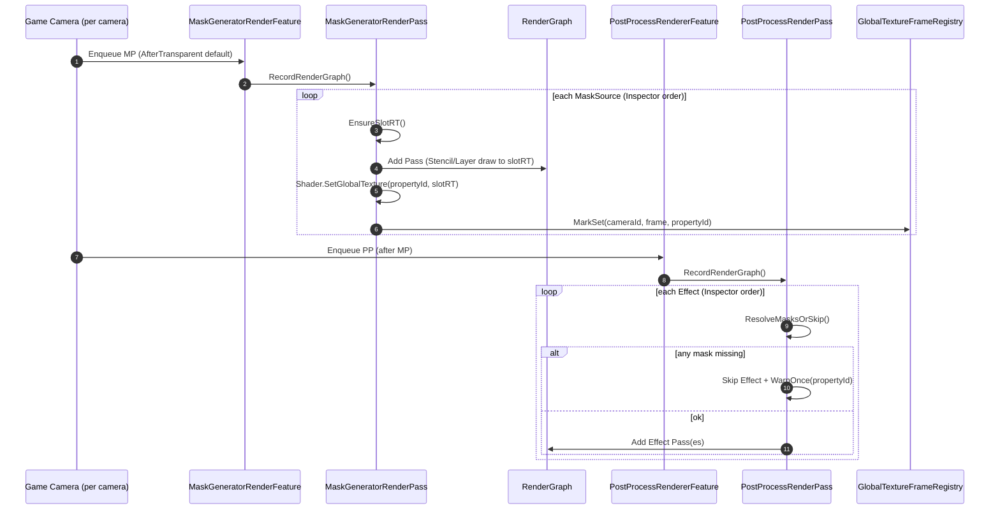
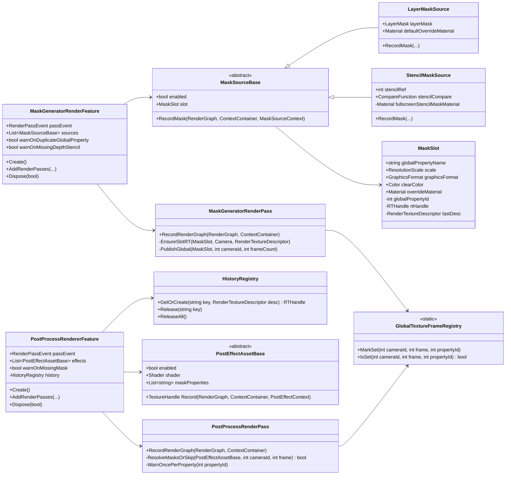

# 最終仕様書 v1.1（命名更新版）
Unity 6000 / URP 17 — **MaskGenerator** + Post Process（独立RenderFeature構成）

---

## 0. 目的

- **MaskGeneratorRenderFeature / MaskGeneratorRenderPass**  
  Layer / Stencil 等から **複数のマスクテクスチャ**を生成し、`Shader.SetGlobalTexture` で公開する。

- **PostProcessRendererFeature / PostProcessRenderPass**  
  画面全体へポスト処理を適用する。ただし各エフェクトは **グローバルマスクを素材として参照**し、強度・ブレンドなどを制御できる。

- 両者は **依存しない**（どちらかがなくても動作し得る）。  
  ただし、マスク必須のエフェクトは **安全策としてスキップ**できる。

---

## 1. 前提・確定事項

### 1.1 実行順・運用
- MaskGenerator と PostProcess は **同一Rendererに配置する前提**。
- デフォルトの `RenderPassEvent` は
  - MaskGenerator：**AfterRenderingTransparents（AfterTransparent）**
  - PostProcess：MaskGeneratorより後になる値（運用で調整）
- 運用で順序が崩れても、PostProcess側は **「未セットのマスク参照」検出でスキップ**する。

### 1.2 複数カメラ
- 複数のGameカメラが **順番に描画**される前提。
- **そのカメラのマスクを使う**（カメラ間で共有しない）。

### 1.3 マスク
- 1つのMaskGeneratorFeature内で、**複数マスクを生成**できる（Stencil Ref 2/3、Layerなど）。
- マスクは **複数スロット**で運用し、「複数Refを1枚にまとめる」要件は **スロット増加で解決**。
- グローバルプロパティは `string` 入力、内部で `PropertyToID` キャッシュ。
- 同名プロパティ衝突は **後勝ち**、かつ **警告**を出す。
- マスク解像度：`x1 / x1/2 / x1/4 / x1/8`
- 更新頻度：**毎フレーム・毎カメラ**
- フォーマット：自由（初期値 **R8_UNorm**）。スロットごとに設定。
- クリア値：スロットごとに設定。
- MSAA：**None固定**
- マスク領域は原則 **白(1.0)** を推奨。ただし最終的な値は **使用するShader/Materialの出力に依存**し、設計として固定しない。

### 1.4 Stencil（既存オブジェクトで設定済み）
- `StencilMaskSource` の公開パラメータ：**Ref / Compare のみ**
- Depth/Stencilが取得できない場合：**全0扱い** + **警告（初回のみ）**

### 1.5 Layer
- LayerMaskのみで対象選別
- DepthTestあり
- **LayerMaskSourceがデフォルトMaterialを保持**
- **スロット側に overrideMaterial を持ち、上書き可能**

### 1.6 PostProcessのマスク参照契約
- EffectAssetは `List<string> maskProperties` を持ち、複数参照可能
- `maskProperties` が空：**マスク不要として通常実行**
- `maskProperties` があり、1つでも「未セット」なら **エフェクト全体をスキップ**
- 未セット警告ログ：**Property単位で初回のみ**

### 1.7 履歴（将来拡張）
- 履歴は **PostProcessRendererFeature内で保持**（外部Featureには分離しない）
- キーは **任意文字列**
- 内部でキーに付加は行わない（ユーザーが衝突回避を管理）

---

## 2. 全体アーキテクチャ

### 2.1 モジュール分離
- MaskGeneratorは **「マスク生成→Global公開」**のみ。
- PostProcessは **「画面処理→必要ならGlobalマスク参照」**のみ。
- 両者は直接参照せず、共通の “安全策” として **グローバルセット済み記録**（後述）を利用する。

---

## 3. データ構造定義

### 3.1 列挙型 `ResolutionScale`
- `Full`（x1）
- `Half`（x1/2）
- `Quarter`（x1/4）
- `Eighth`（x1/8）

---

### 3.2 `MaskSlot`（マスク出力スロット）

**目的**：1枚のマスク出力（RT + Global公開）を定義する。

#### フィールド（Inspector公開）
- `string globalPropertyName`
- `ResolutionScale scale`
- `GraphicsFormat graphicsFormat`（default: `R8_UNorm`）
- `Color clearColor`
- `Material overrideMaterial`（optional：主にLayerで使用）

#### 実行時キャッシュ（非公開）
- `int globalPropertyId`（`Shader.PropertyToID(globalPropertyName)`）
- `RenderTextureDescriptor lastDesc`（再確保判定用）
- `RTHandle rtHandle`（永続保持）

#### 仕様
- **スロット単位**でRTを保持し、カメラ間で順次再利用する（「同一解像度なら共有」）。
- 同一スロットでカメラ解像度が同じなら再利用する。
- 解像度/フォーマット等が変われば **自動再確保**。
- マスクRTは **MSAA None固定**。

---

## 4. MaskGenerator仕様

### 4.1 `MaskGeneratorRenderFeature`

#### 役割
- Passの生成・破棄
- Sources（`MaskSourceBase` 派生）の管理
- `RenderPassEvent` の公開（運用調整）

#### 主要フィールド（Inspector）
- `RenderPassEvent passEvent`（default: AfterRenderingTransparents）
- `List<MaskSourceBase> sources`
- `bool warnOnDuplicateGlobalProperty`（default: true）
- `bool warnOnMissingDepthStencil`（default: true）

#### 主要関数
- `Create()`
  - RenderPass生成、ソース初期化（必要なら）
- `AddRenderPasses(ScriptableRenderer renderer, ref RenderingData renderingData)`
  - Gameカメラ以外を除外
  - Passに設定を渡して enqueue
- `Dispose(bool disposing)`
  - スロットRTの解放（各Source/Slotに委譲しても良い）

---

### 4.2 `MaskGeneratorRenderPass`

#### 役割
- `RecordRenderGraph` 内で Source を Inspector順に処理
- 各 Slot を確保/クリアし、マスク生成パスを登録
- パス後に `Shader.SetGlobalTexture` し、**“このカメラで今フレームセットした”**記録を残す

#### 主要関数
- `RecordRenderGraph(RenderGraph rg, ContextContainer frameData)`
  1. current camera を取得  
  2. `sources` を Inspector順にループ  
  3. `source.enabled` なら `source.RecordMask(...)` 実行  
  4. 出力先スロットを global に公開  
  5. 衝突があれば警告（後勝ち）

- `EnsureSlotRT(MaskSlot slot, Camera camera, in RenderTextureDescriptor baseDesc)`
  - scale / format / msaa none を反映した desc を作る
  - `slot.rtHandle` が null または desc が変化したら再確保

- `ClearSlotRT(...)`
  - slot.clearColor で明示クリア  
  - 実装は「Sourceのパス内」か「Pass側で統一」どちらでも良いが、仕様上は **必ずクリアされる**こと

- `PublishGlobal(MaskSlot slot, int cameraId, int frameCount)`
  - `Shader.SetGlobalTexture(slot.globalPropertyId, slot.rtHandle)`
  - `GlobalTextureFrameRegistry.MarkSet(cameraId, frameCount, slot.globalPropertyId)`
  - 同一フレーム同一カメラで同名が既にセット済みの場合、`warnOnDuplicateGlobalProperty` に従い警告（後勝ち）

---

### 4.3 `MaskSourceBase`（抽象）

#### 役割
- “入力（Stencil/Layer）→ MaskSlot出力”の単位
- **1Source = 1Slot**（確定）

#### フィールド（共通）
- `bool enabled`
- `MaskSlot slot`

#### 抽象関数
- `void RecordMask(RenderGraph rg, ContextContainer frameData, in MaskSourceContext ctx)`

#### `MaskSourceContext`（Pass→Sourceの引数構造体）
- `int cameraId`
- `RenderTextureDescriptor cameraDesc`
- `TextureHandle activeDepth`（取得できる場合）
- `TextureHandle activeColor`（必要なら）
- `RTHandle slotRT`（出力先）

---

### 4.4 `StencilMaskSource`

#### 目的
- “既存のStencil結果”を、**マスクテクスチャとして書き出す**。

#### 公開フィールド（Inspector）
- `int stencilRef`
- `CompareFunction stencilCompare`

#### 内部リソース
- `Material fullscreenStencilMaskMaterial`
  - Stencil Testを行い、通った領域に所定の色（基本白）を出力するフルスクリーン用
  - 出力値はMaterial/Shaderにより変更可能（仕様）

#### Record仕様
- `activeDepth`（Depth/Stencil）が無い場合
  - slotRT を **clearColor（通常0）**で終える
  - `warnOnMissingDepthStencil` が true なら **警告（初回のみ）**
- Depth/Stencilがある場合
  - slotRT をクリア
  - RenderGraphにフルスクリーン描画パスを登録  
    - Depthをアタッチして Stencil Test を有効化  
    - ColorはslotRTへ  
    - “Stencil条件を満たす画素だけ”書き込む  

---

### 4.5 `LayerMaskSource`

#### 目的
- 指定Layerのレンダラーを描画し、マスクテクスチャを生成する。

#### 公開フィールド（Inspector）
- `LayerMask layerMask`
- `Material defaultOverrideMaterial`

#### スロット上書き仕様
- 実際に使うMaterialは
  - `slot.overrideMaterial != null` → それを使用
  - else `defaultOverrideMaterial` を使用
- Materialが最終的に null の場合
  - slotRT を clearColorで終える
  - 警告（初回のみ推奨）

#### Record仕様
- slotRTをクリア
- RendererListを構成（LayerMaskでフィルタ）
- DepthTestあり（カメラ深度と比較する）
  - 深度が無いケースの扱いは実装で明確化する（推奨：Stencil同様に全0 + 警告）
- overrideMaterialで描画し、slotRTへ書き込む  
  - 出力値（白など）はMaterial次第（仕様）

---

## 5. PostProcess仕様

### 5.1 `PostProcessRendererFeature`

#### 役割
- エフェクトリスト（SO）の保持
- Pass生成・破棄
- 履歴レジストリの保持（将来用）

#### 公開フィールド（Inspector）
- `RenderPassEvent passEvent`（外部公開で運用調整）
- `List<PostEffectAssetBase> effects`
- `bool warnOnMissingMask`（default: true）
- `bool warnOncePerProperty`（fixed: true）

#### 実行時（推奨キャッシュ）
- `Dictionary<PostEffectAssetBase, Material> materialCache`（必要なら）
- `HistoryRegistry history`（Feature内保持）

#### 主要関数
- `Create()`：Pass生成、Material準備
- `AddRenderPasses(...)`：Gameカメラ以外を除外して enqueue
- `Dispose(...)`：Material破棄、履歴解放（必要なら）

---

### 5.2 `PostProcessRenderPass`

#### 役割
- `RecordRenderGraph` 内で effects を順次実行し、最終的にactiveColorへ戻す
- 1クラス（単一Pass）で、内部で複数RenderGraphパスを登録して処理する

#### 処理仕様
- effect順は **Inspector順**（基盤段階では優先度ソートなし）
- `maskProperties` の評価：
  - 空 → 通常実行
  - 非空 → すべての property が「当該カメラ・当該フレームで Set された」必要がある  
    - 1つでも未セット → **エフェクト全体をスキップ**
    - 警告は **Property単位で初回のみ**

#### 主要関数
- `RecordRenderGraph(RenderGraph rg, ContextContainer frameData)`
  1. `cameraId`, `frameCount` を取得  
  2. `source = activeColor`  
  3. effectsをループ  
     - enabled確認  
     - `ResolveMasksOrSkip(effect, cameraId, frameCount)`  
     - skipなら continue  
     - `source = effect.Record(..., source)`  
  4. 最終sourceをactiveColorへ書き戻す（必要なら）

- `bool ResolveMasksOrSkip(PostEffectAssetBase effect, int cameraId, int frameCount)`
  - `effect.maskProperties` を走査
  - `PropertyToID` をキャッシュしつつ `GlobalTextureFrameRegistry.IsSet(cameraId, frameCount, propertyId)` をチェック
  - 未セットがあれば `WarnOncePerProperty(propertyId)` して false

- `WarnOncePerProperty(int propertyId)`
  - `HashSet<int> warnedPropertyIds`（静的）で抑制
  - 既に含まれていたらログ無し

---

### 5.3 `PostEffectAssetBase`（抽象ScriptableObject）

#### 役割
- エフェクトのデータ定義と、RenderGraphへのパス登録（Record）を提供
- 各エフェクトは **必要なマスク名を自分で宣言**して参照する（Featureに依存しない）

#### 公開フィールド（Inspector）
- `bool enabled`
- `Shader shader`（またはMaterial参照方針）
- `List<string> maskProperties`（参照したいグローバルマスク）
- エフェクト固有パラメータ（自由）

#### 実行時キャッシュ（推奨）
- `List<int> maskPropertyIdsCache`（string→idのキャッシュ）
- `Material materialInstance`（Feature側で生成して持つ運用でも可）

#### 抽象関数
- `TextureHandle Record(RenderGraph rg, ContextContainer frameData, in PostEffectContext ctx)`
  - 入力 `ctx.sourceColor` を加工し、新しい `TextureHandle` を返す
  - 複数パスが必要なら内部で複数登録可能（基盤なので今は単発でもOK）

#### `PostEffectContext`
- `TextureHandle sourceColor`
- `TextureHandle activeDepth`（必要なら）
- `RenderTextureDescriptor cameraDesc`
- `int cameraId`
- `int frameCount`
- `HistoryRegistry history`（将来用）
- ※ マスクTexture自体は **Shader Global から取得する設計**（ctxにTextureHandleを渡さない）

---

## 6. 共通ユーティリティ仕様

### 6.1 `GlobalTextureFrameRegistry`（安全策の中核）

#### 目的
- `Shader.SetGlobalTexture` は“前フレームの値が残る”ため、  
  **「このカメラの、このフレームでセットされた」**かを判定する仕組みが必要。

#### データ（例）
- `Dictionary<(int cameraId, int frameCount), HashSet<int propertyId>>`  
  ※より軽量な実装でも良い（仕様は API を固定する）

#### 関数
- `void MarkSet(int cameraId, int frameCount, int propertyId)`
- `bool IsSet(int cameraId, int frameCount, int propertyId)`
- `void CleanupOldFrames(int currentFrameCount)`（任意：メモリ増加抑制）

---

## 7. ログ仕様（最終）

### 7.1 重複グローバル名（MaskGenerator）
- 事象：同一フレーム・同一カメラで、複数Sourceが同じ `globalPropertyName` に書き込む
- 挙動：**後勝ち**で上書き
- ログ：**警告を出す**（抑制は任意。ノイズ回避のため「Property単位で初回のみ」を推奨）

### 7.2 Depth/Stencil未取得（StencilMaskSource）
- 挙動：スロットは全0（クリアのみ）
- ログ：警告（初回のみ推奨）

### 7.3 PostProcessでマスク未セット
- 挙動：エフェクト全体をスキップ
- ログ：**Property単位で初回のみ**

---

## 8. 処理フロー図

### 8.1 シーケンス（複数カメラ順描画）

---

## 9. クラス図（最終）

---

## 10. 定数・初期値（最終）

- `MaskGeneratorRenderFeature.passEvent` default  
  - **AfterRenderingTransparents**
- `MaskSlot.graphicsFormat` default  
  - **R8_UNorm**
- `MaskSlot.msaa`  
  - **None固定（常に1）**
- `MaskSlot.scale`  
  - `Full/Half/Quarter/Eighth`
- ログ抑制（Post）
  - **Property単位**（`HashSet<int> warnedPropertyIds`）

---

## 11. 拡張ポイント（将来機能）

### 11.1 MaskGenerator側
- `MaskSourceBase` 派生を追加して入力を増やせる
  - 例：Depth由来、外部Texture取り込み、Composite（OR/AND）等
- `MaskSlot` に追加フィールドを増やせる
  - 例：mip生成、フィルタ、クリアマスクなど

### 11.2 PostProcess側
- `PostEffectAssetBase.Record` 内で複数パス登録（Blur等）可能
- `HistoryRegistry` を使ったフレーム間保持に拡張可能
  - キーはユーザー文字列で衝突回避はユーザー責務（仕様）

---

## 12. 運用ルール（明文化推奨）

1) MaskGeneratorはPostProcessより前に実行されるよう `RenderPassEvent` を設定する  
2) マスク参照を行うエフェクトは `maskProperties` に必要なglobal名を登録する  
3) 未セットのマスクがあるとエフェクトはスキップされる（安全）  
4) 同名globalのマスクは後勝ち（警告あり）  
5) 複数カメラ環境では「各カメラの描画中に作られたマスク」が使われる  
6) マスク値の意味（白/黒等）は、使用Shader/Materialの仕様に従う（システム側で固定しない）

---
